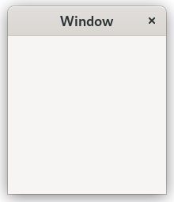
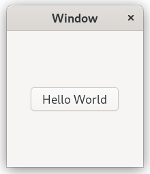
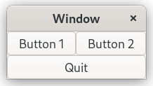
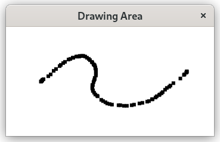

# Ruby/GTK4 getting started

This is a ruby adaptation of the [official tutorial](https://docs.gtk.org/gtk4/getting_started.html) for the C language.

The Gtk4 module of the ruby-gnome project is an implementation of the ruby bindings for GTK.

GTK is a [widget toolkit](http://en.wikipedia.org/wiki/Widget_toolkit). Each user interface created by GTK consists of widgets. Widgets are organized in a hierarchy. The window widget is the main container. The user interface is then built by adding buttons, drop-down menus, input fields, and other widgets to the window. If you are creating complex user interfaces it is recommended to use `Gtk::Builder` and its GTK-specific markup description language, instead of assembling the interface manually.

GTK is event-driven. The toolkit listens for events such as a click on a button, and passes the event to your application.

This chapter contains some tutorial information to get you started with GTK programming. It assumes that you have GTK, its dependencies and ruby with the gtk4 gem installed.

## Basics
To begin our introduction to GTK, we’ll start with a very simple application. This program will create an empty 200 × 200 pixel window.



```ruby
# example-0.rb
require "gtk4"

application = Gtk::Application.new("org.gtk.example", :flags_none)

application.signal_connect "activate" do |app|
  window = Gtk::ApplicationWindow.new(app)
  window.title = "Window"
  window.set_default_size(200, 200)
  window.show
end

application.run
```

When creating a Gtk::Application you need to pick an application identifier (a name) and input to `Gtk::Application#new` as parameter. For this example *org.gtk.example* is used but for choosing an identifier for your application see this [guide](https://wiki.gnome.org/HowDoI/ChooseApplicationID).

Lastly `Gtk::Application#new` takes a `Gio::ApplicationFlags` constant as input for your application, if your application would have special needs (those constants can be replaced by theirs respective symbol ie. `Gio::ApplicationFlags::FLAGS_NONE` == `:flags_none`). You must know that `Gio:::Application` ignores arguments passed to `Gio::Application#run` on the Windows systems. It always uses command line arguments even when we pass an empty array to `Gio::Application#run`.

If you plan to create a cross-platform application, it is recommended to use the `:handles_command_line` flags and the *command-line* signal. (reference : https://github.com/ruby-gnome/ruby-gnome/issues/721 ).

Next we add instructions for the "activate" event of the `Gtk::Application` instance we created. The activate signal will be sent when your application is launched with the method `Gtk::Application#run` on the line below. This method also takes as arguments a ruby array of string. This allows GTK to parse specific command line arguments that control the behavior of GTK itself. Your application can override the command line handling, e.g. to open files passed on the commandline.

A window title is set using `Gtk::ApplicationWindow#title=`. This setter function takes a string as input.

Finally the window size is set using `Gtk::ApplicationWindow#set_default_size` and the window is then shown by GTK via `Gtk::Widget#show`.

While the program is running, GTK is receiving *events*. These are typically input events caused by the user interacting with your program, but also things like messages from the window manager or other applications. GTK processes these and as a result, signals may be emitted on your widgets. Connecting handlers for these signals is how you normally make your program do something in response to user input.

The following example is slightly more complex, and tries to showcase some of the capabilities of GTK.

## Hello, World

In the long tradition of programming languages and libraries, this example is called *Hello, World*.



```ruby
# example-1.rb
application = Gtk::Application.new("org.gtk.example", :flags_none)

application.signal_connect "activate" do |app|
  window = Gtk::ApplicationWindow.new(app)
  window.title = "Window"
  window.set_default_size(200, 200)

  button_box = Gtk::Box.new(:horizontal)
  button_box.halign = :center
  button_box.valign = :center
  window.set_child(button_box)

  button = Gtk::Button.new(label: "Hello World")

  button.signal_connect "clicked" do
    puts "Hello World"
    window.destroy
  end
  button_box.append(button)

  window.show
end

application.run
```

As seen above, example-1.rb builds further upon example-0.rb by adding a button to our window, with the label “Hello World”.

The button_box variable stores a `Gtk::Box` object, which is GTK's way of controlling the size and layout of widgets. The `Gtk::Box` is created with the method `Gtk::Box#new` which takes a `Gtk::Orientation `constant as parameter or the related symbols (`:vertical` or `:horizontal`).

The buttons which this box will contain can either be stored horizontally or vertically but this does not matter in this particular case as we are dealing with only one button. After initializing button_box with horizontal orientation, the code adds the button_box widget to the window widget using `Gtk::Box#append`.

Next the button variable is initialized in similar manner. The method `Gtk::Button#new` is called which returns a `Gtk::Button` to be stored in button. A label is set using a ruby hash as argument: `label: "Hello World"`. Afterwards button is added to our button_box.

Using the method `Gtk::Button#signal_connect` we add instructions, so that when the button is clicked, a message will be displayed in the terminal if the GTK application was started from one.

After that, `Gtk::ApplicationWindow#destroy` is called. This method is inherited from `Gtk::Widget`. This has the effect that when the button is clicked, the whole GTK window is destroyed. More information about creating buttons can be found [here](https://wiki.gnome.org/HowDoI/Buttons).

The rest of the code in example-1.rb is identical to example-0.rb. Next section will elaborate further on how to add several GtkWidgets to your GTK application.

## Packing

When creating an application, you’ll want to put more than one widget inside a window. When you do so, it becomes important to control how each widget is positioned and sized. This is where packing comes in.

GTK comes with a large variety of layout containers whose purpose it is to control the layout of the child widgets that are added to them, like:

* [Gtk::Box](https://docs.gtk.org/gtk4/class.Box.html)
* [Gtk::Grid](https://docs.gtk.org/gtk4/class.Grid.html)
* [Gtk::Revealer](https://docs.gtk.org/gtk4/class.Revealer.html)
* [Gtk::Stack](https://docs.gtk.org/gtk4/class.Stack.html)
* [Gtk::Overlay](https://docs.gtk.org/gtk4/class.Overlay.html)
* [Gtk::Paned](https://docs.gtk.org/gtk4/class.Paned.html)
* [Gtk::Expander](https://docs.gtk.org/gtk4/class.Expander.html)
* [Gtk::Fixed](https://docs.gtk.org/gtk4/class.Fixed.html)

The following example shows how the `Gtk::Grid` container lets you arrange several buttons:



```ruby
# example-2.rb
require "gtk4"

application = Gtk::Application.new("org.gtk.example", :flags_none)

application.signal_connect "activate" do |app|
  # Create a new window and set its title
  win = Gtk::ApplicationWindow.new(app)
  win.title = "Window"

  # Here we construct the container that is going to pack our buttons.
  grid = Gtk::Grid.new

  # Pack the container in the window
  win.set_child(grid)

  button = Gtk::Button.new(label: "Button 1")
  button.signal_connect("clicked") { puts "Hello World!" }

  # Place the first button in the grid cell (0, 0), and make it fill
  # just 1 cell horizontally and vertically (ie no spanning)
  grid.attach(button, 0, 0, 1, 1)

  button = Gtk::Button.new(label: "Button 2")
  button.signal_connect("clicked") { puts "Hello World!" }

  # Place the second button in the grid cell (1, 0), and make it fill
  # just 1 cell horizontally and vertically (ie no spanning)
  grid.attach(button, 1, 0, 1, 1)

  button = Gtk::Button.new(label: "Quit")
  button.signal_connect("clicked") { win.destroy }

  # Place the Quit button in the grid cell (0, 1), and make it
  # span 2 columns.
  grid.attach(button, 0, 1, 2, 1)

  win.show
end

application.run
```

## Custom Drawing

Many widgets, like buttons, do all their drawing themselves. You just tell them the label you want to see, and they figure out what font to use, draw the button outline and focus rectangle, etc. Sometimes, it is necessary to do some custom drawing. In that case, a `Gtk::DrawingArea` might be the right widget to use. It offers a canvas on which you can draw by setting its draw function.

The contents of a widget often need to be partially or fully redrawn, e.g. when another window is moved and uncovers part of the widget, or when the window containing it is resized. It is also possible to explicitly cause a widget to be redrawn, by calling `Gtk::Widget#queue_draw`. GTK takes care of most of the details by providing a ready-to-use cairo context to the draw function.

The following example shows how to use a draw function with `Gtk::DrawingArea`. It is a bit more complicated than the previous examples, since it also demonstrates input event handling with event controllers.



### Drawing in response to input

```ruby
# example-3.rb
require "gtk4"

def clear_surface(surface)
  cr = Cairo::Context.new(surface)
  cr.set_source_rgb(1, 1, 1)
  cr.paint
  cr.destroy
end

# Draw a rectangle on the surface at the given position
def draw_brush(widget, surface, x, y)
  cr = Cairo::Context.new(surface)
  cr.rectangle(x - 3, y - 3, 6, 6)
  cr.fill
  widget.queue_draw
end

def generate_surface_from_widget(widget)
  widget.native.surface.create_similar_surface(Cairo::CONTENT_COLOR,
                                               widget.allocated_width,
                                               widget.allocated_height)
end

myapp = Gtk::Application.new("org.gtk.example", :flags_none)

myapp.signal_connect "activate" do |app|
  win = Gtk::ApplicationWindow.new(app)
  win.set_title("Drawing Area")

  surface = nil

  win.signal_connect "destroy" do
    surface.destroy if surface
    win.destroy
  end

  drawing_area = Gtk::DrawingArea.new
  # Set a minimum size
  drawing_area.set_size_request(100, 100)
  win.set_child(drawing_area)

  drawing_area.set_draw_func do |da, cr|
    if surface.nil?
      surface = generate_surface_from_widget(da)
      ## Initialize the surface to white
      clear_surface(surface)
    end
    # Redraw the screen from the surface. Note that the draw
    # callback receives a ready-to-be-used cairo_t that is already
    # clipped to only draw the exposed areas of the widget
    cr.set_source(surface, 0, 0)
    cr.paint
  end

  drawing_area.signal_connect_after "resize" do |da, alloc|
    surface.destroy if surface
    surface = generate_surface_from_widget(da)
    # Initialize the surface to white
    clear_surface(surface) if surface
  end

  drag = Gtk::GestureDrag.new
  drag.button = Gdk::BUTTON_PRIMARY
  drawing_area.add_controller(drag)

  start_x = 0.0
  start_y = 0.0

  drag.signal_connect "drag-begin" do |gesture, x, y|
    start_x = x
    start_y = y
    draw_brush(drawing_area, surface, x, y)
  end

  drag.signal_connect "drag-update" do |gesture, x, y|
    draw_brush(drawing_area, surface, start_x + x, start_y + y)
  end

  drag.signal_connect "drag-end" do |gesture, x, y|
    draw_brush(drawing_area, surface, start_x + x, start_y + y)
  end

  press = Gtk::GestureClick.new
  press.button = Gdk::BUTTON_SECONDARY
  drawing_area.add_controller(press)
  press.signal_connect "pressed" do |gesture, n_press, x, y|
    clear_surface(surface)
    drawing_area.queue_draw
  end
  win.show
end

myapp.run
```

## Building user interfaces
When constructing a more complicated user interface, with dozens or hundreds of widgets, doing all the setup work in code is cumbersome, and making changes becomes next to impossible.

Thankfully, GTK supports the separation of user interface layout from your business logic, by using UI descriptions in an XML format that can be parsed by the `Gtk::Builder` class.

### Packing buttons with GtkBuilder

Create a new file with the following content:

```ruby
# example-4.rb
require "gtk4"

app = Gtk::Application.new("org.gtk.example", :flags_none)

app.signal_connect "activate" do
  # Construct a GtkBuilder instance and load our UI description
  builder = Gtk::Builder.new(file: File.join(__dir__, "builder.ui"))

  # Connect signal handlers to the constructed widgets.
  window = builder["window"]
  window.set_application(app)

  button = builder["button1"]
  button.signal_connect("clicked") { puts "Hello World!" }

  button = builder["button2"]
  button.signal_connect("clicked") { puts "Hello World!" }

  button = builder["quit"]
  button.signal_connect("clicked") { window.close }

  window.show
end

app.run
```

Then, create a new file with the following content named `builder.ui`.

```xml
<?xml version="1.0" encoding="UTF-8"?>
<interface>
  <object id="window" class="GtkWindow">
    <property name="title">Grid</property>
    <child>
      <object id="grid" class="GtkGrid">
        <child>
          <object id="button1" class="GtkButton">
            <property name="label">Button 1</property>
            <layout>
              <property name="column">0</property>
              <property name="row">0</property>
            </layout>
          </object>
        </child>
        <child>
          <object id="button2" class="GtkButton">
            <property name="label">Button 2</property>
            <layout>
              <property name="column">1</property>
              <property name="row">0</property>
            </layout>
          </object>
        </child>
        <child>
          <object id="quit" class="GtkButton">
            <property name="label">Quit</property>
            <layout>
              <property name="column">0</property>
              <property name="row">1</property>
              <property name="column-span">2</property>
            </layout>
          </object>
        </child>
      </object>
    </child>
  </object>
</interface>
```

The usage of the `Gtk::Builder` is easy, we just create an instance from the
file "builder.ui" with `Gtk::Builder.new(file: path/to/builder.ui)`. Then you can access every widget or part of the interface thanks to its name: `window = builder["window"]`. Note that `Gtk::Builder` can also be used to construct objects that are not widgets, such as tree models, adjustments, etc.

It is also possible to embed the UI description in the source code as a string and use `GtkBuilder::add_from_string` to load it. But keeping the UI description in a separate file has several advantages:

* it is easier to isolate the UI code from the business logic of your application
* it is easier to restructure your UI into separate classes using composite widget templates
